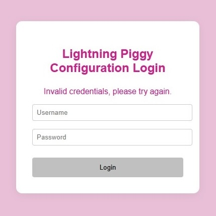

## Preparation

### Sourcing Parts

LILYGO T5 V2.3.1 (2.13 inch screen) e-paper device: [AliExpress](https://www.lilygo.cc/lightningpiggy)

### Creating an LNbits Wallet

We recommend setting up LNbits on your own node such as a [Raspiblitz](https://raspiblitz.org), [Start 9](https://start9.com) or an [Umbrel](https://umbrel.com). Please follow the set-up instructions provided by the node provider.

---

## Set-up

### Connecting your device

Nothing happens when I plug the device into the computer.

*Ensure you are using a USB cable that can transmit data. Many micro USB cables only supply power and lack data transmission capabilities. Often, these cables have no distinguishing markings, so the simplest method to determine if your cable supports data transfer is to connect a memory device (like a data drive) to the computer using the cable and check if the computer recognizes the data drive.*

### Flashing the Firmware

For v1 piggies, use our custom built [web installer](https://lightningpiggy.github.io/) to flash the firmware to the device.

For v2 piggies, flash [MicroPythonOS](https://install.micropythonos.com/) to your compatable device and then install the Lightning Piggy app via the built-in app store.

---

### LILYGO TTGO T5 2.66 inch E-paper device

The device does not turn on (device leds stay dark) when connected to my computer.

1. *Check you have a USB to TTL (T-U2T) connector connected between the device and your USB cable.*
2. *Check the device is not faulty by connecting it to a power supply, instead of the computer. The red power led should light up.*

---

## Connectivity & WiFi

### WiFi connection issues after waking from sleep (v1)

The device fails to reconnect to WiFi after waking from sleep mode.

*Ensure your WiFi access point is stable and within range. If the device shows connection errors after waking, press the reset button to force a fresh connection attempt. You can also try positioning the Piggy closer to your router.* See [GitHub #34](https://github.com/LightningPiggy/lightning-piggy/issues/34)

### Default configuration login credentials (v1)

I'm trying to connect to my Lightning Piggy and I don't know the default credentials.

*The web address and login credentials are displayed on the Piggy's screen. The default username is `piggy` and the default password is `oinkoink`.*

*Lightning Piggy Configuration Login*

---

## QR Code & Display Issues

### LNBits QR code does not change to Lightning Address (v1)

After configuring NWC with a Lightning Address, the display still shows the old LNBits QR code.

*This can occur when both LNBits and NWC credentials are configured. To display your Lightning Address QR code, ensure only NWC credentials are set. Access the Piggy Config interface (connect to the device's WiFi access point) and clear the LNBits server URL and invoice key fields, then save and restart.* See [GitHub #1](https://github.com/LightningPiggy/LightningPiggyApp/issues/1)

### QR Code Scanner shows white screen (app)

The QR scanner in the companion app displays a blank white screen instead of the camera view.

*This issue may be related to camera permissions or app initialization. Ensure the app has camera permissions enabled in your device settings. Try force-closing and reopening the app. If the problem persists, try reinstalling the app.* See [GitHub #2](https://github.com/LightningPiggy/LightningPiggyApp/issues/2)

---

## App Installation

### MicroPythonOS app store fails to install Lightning Piggy (app)

The Lightning Piggy app cannot be installed from the MicroPythonOS app store.

*This issue was resolved in app version 0.0.11. Ensure you are running the latest version of the MicroPythonOS app store. If the problem persists, try manual installation via the [web installer](https://lightningpiggy.github.io/).* See [GitHub #38](https://github.com/LightningPiggy/lightning-piggy/issues/38)

---

## Operating

### Device Display Information (v1)

The screen only displays "0 sats" i.e. there is no QR code on the screen to scan.

*If using LNbits, check that you enabled and configured the LNURLp extension during the wallet set-up.*

"NOBAT" is displayed on the screen, even though a charged battery is connected.

*The system's battery detection relies on heuristics and is not always 100% accurate. Rapid voltage fluctuations lead to an assumption that the device is not on battery power, while very stable voltage suggests that it is running on the battery. If the battery is charged and you have a power cable connected, try disconnecting the power cable. Alternatively, if you wish to power the device by an external source (USB power), disconnect the device battery.*

### Battery

Unsure if the battery is working correctly (v1)?

*To check that the battery is working correctly, unplug any connected USB power source and press the reboot button so that the device boots while on battery power.*

*Lilygo T5 2.13 inch Controls*

---

## Wallet & Balance

### Balance Bias setting not showing on restart

The Balance Bias configuration option disappears or resets after restarting the device.

*This bug has been fixed. Update to the latest firmware version via the [web installer](https://lightningpiggy.github.io/) to resolve this issue.* See [GitHub #19](https://github.com/LightningPiggy/lightning-piggy/issues/19)

### Wallet connection issues with Coinos v1 & v2

The device shows "null" or fails to connect when using Coinos wallet.

*This issue was resolved in firmware version 6.1.0. Update your device to the latest firmware via the [web installer](https://lightningpiggy.github.io/).* See [GitHub #30](https://github.com/LightningPiggy/lightning-piggy/issues/30)

---

## Advanced

### Building From Source

MacOS iCloud and Arduino library conflicts

*Arduino library folder Conflicts: It has been noted in Arduino version 1.8.16 that conflicts can occur due to the iCloud upload status of files in the Arduino library folder that can prevent successful builds. One solution is wait until all folders and files have synchronised with iCloud before building.*

---

## Community Q&A

*Have a question not answered here? Join our [Telegram group](https://t.me/+Y2zSiQELdXxhZDlk) for live support from other Lightning Piggy builders.*

*If you've discovered a solution to a common problem, please share it with the community or email [oink@lightningpiggy.com](mailto:oink@lightningpiggy.com) so we can add it here.*
